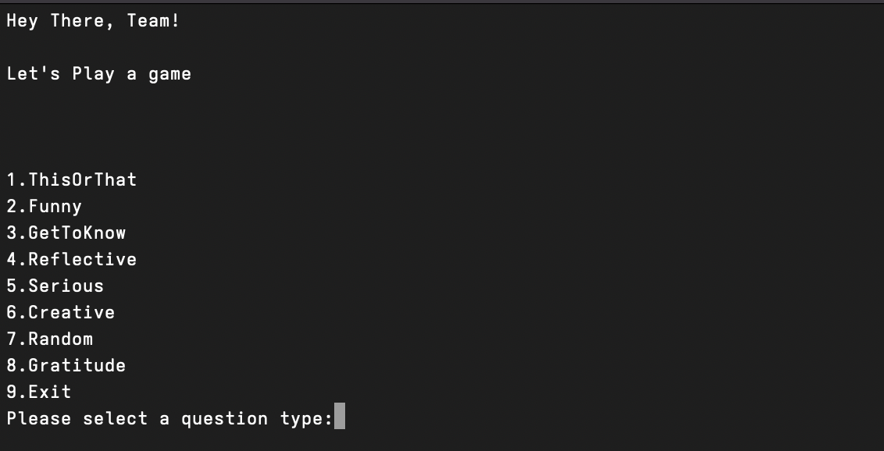
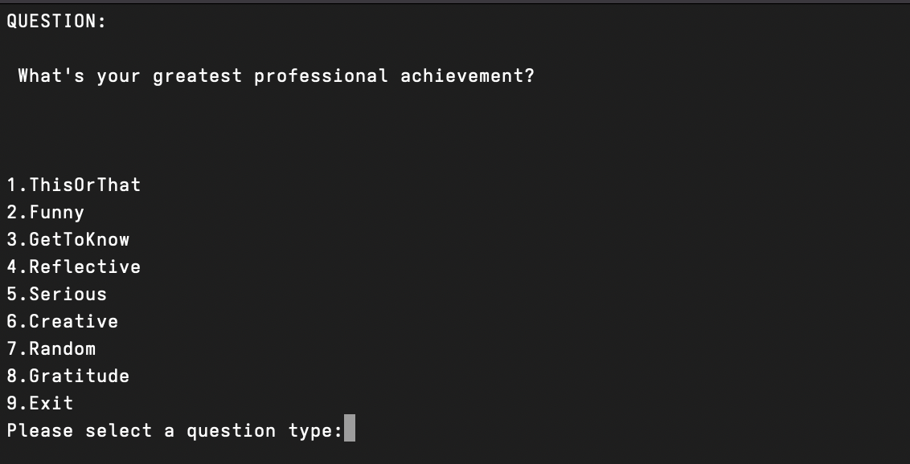
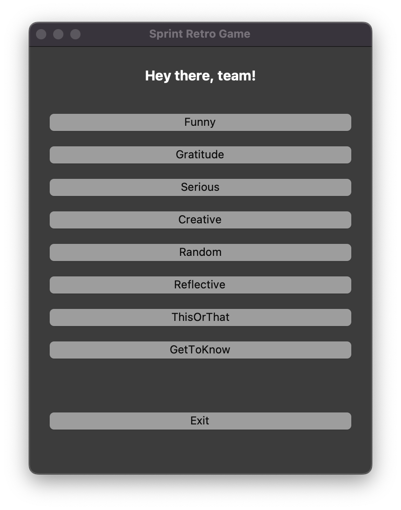
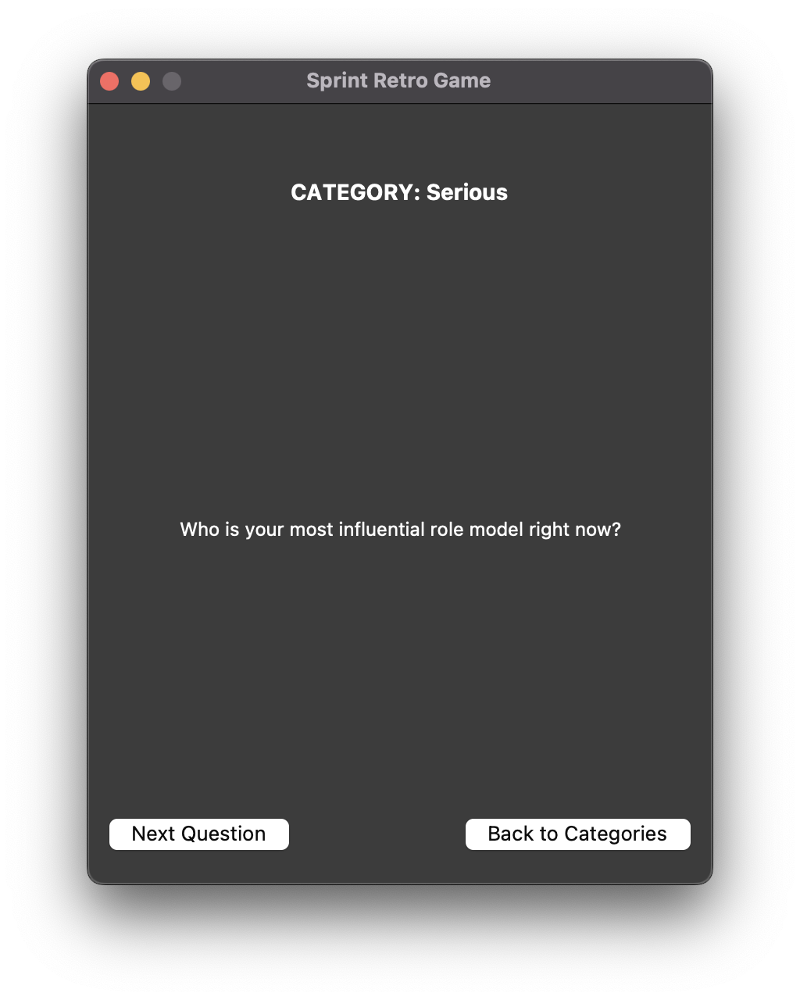

# Simple Sprint Retro Game

Help break the ice at the start of a sprint retro session.

### Questions
Pre-built with **92** questions currently all gathered from: [Question source](https://slideswith.com/blog/team-building-questions). 

### How to run
For the TUI version in the root directory run:
```bash
bash game.sh 
```

For the GUI version in the root directory run:
```bash
python3.14 game.py
```

### Installation
The whole project had the aim to come with everything installed on your system. If you have bash version above 4.0 and python 3.14 installed you should be good to go.  

**MacOS** comes with an old bash release. To mitigate this issue run the following commands:
```bash
brew install bash
echo 'export PATH="/opt/homebrew/bin:$PATH"' >> ~/.zshrc
```

### TUI or GUI?
In the project bundled is a bash script to provide a simple TUI (terminal user interface) and a python script to provide a simple GUI (graphical user interface). Both of them are built with simplicity in mind.

TUI screenshots:



GUI screenshots:

